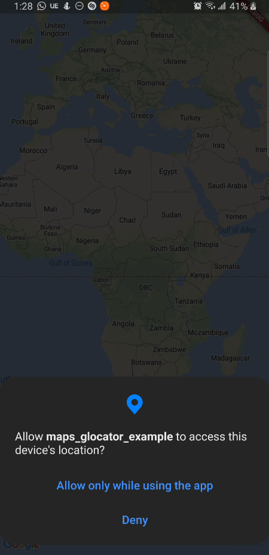
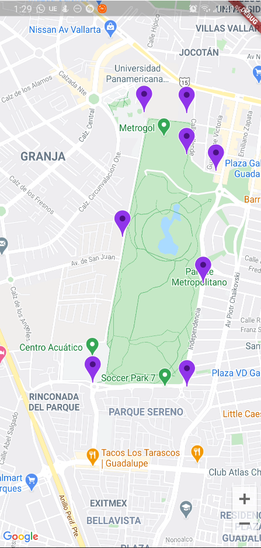

# App Maps

App para conocer el Google Cloud, servicios, y configurar Maps en Flutter
- implementar google maps en flutter con manejo de marcadores
- ubicaciones con geocode y geolocator

## Getting Started

Recuerda que despues de clonar el proyecto, abrir una terminal dentro de la carpeta del proyecto y ejecutar el comando:

```sh
flutter packages get
``` 


